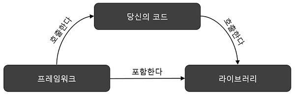

# Framework vs Library

> 프레임워크는 무엇이고 라이브러리는 무엇이며 그 둘의 정확한 차이점은 무엇일까?(에 대한 대답을 하지못해 정리해 봅니다… 또륵)

*시작하기전에... http://webclub.tistory.com/458 블로그의 내용을 많이 참고하였음을 알립니다.(좋은 글을 작성해 주신 재희님께 감사드립니다.)*

---

**프레임워크는 단지 미리 만들어 둔 반제품이나, 확장해서 사용할 수 있도록 준비된 라이브러리의 집합이 아니다.**

프레임워크와 라이브러리의 차이점에 대해 알아보기 전에 각각에 대해 알아보도록 하자.

  

### Framework(프레임워크)

프레임워크는 `뼈대`나 `기반구조`를 뜻하며, `제어의 역전 개념(IoC)`이 적용된 대표적인 기술이다.

소프트웨어에서 프레임워크란 ''소프트웨어의 특정 문제를 해결하기 위해서 상호 협력하는 클래스, 인터페이스의 집합이라 할 수 있으며, 완성된 어플리케이션이 아닌 프로그래머가 완성시키는 작업이 필요하다.

즉, 프레임워크는 객체 지행 개발에서 통합성, 일관성 부족의 문제를 해결할 방법중 하나라고 할 수 있다.

#### 프레임워크의 특징

- 특정 개념들의 추상화를 제공하는 여러 클래스나 컴포넌트로 구성되어있다.
- 추상적 개념들이 문제를 해결하기 위해 같이 작업하는 방법을 정의한다.
- 컴포넌트들의 재사용이 가능하다.
- 높은 수준에서 패턴의 조작화가 가능하다.

### 라이브러리(Library)

라이브러리는 단순 활용가능한 도구들의 집합을 말한다.

개발자가 만든 클래스에서 호출하여 사용, 클래스들의 나열로 필요한 클래스를 불러서 사용하는 방식을 취하고 있다.

---

### 프레임워크와 라이브러리의 차이점

프레임워크와 라이브러리의 가장 큰 차이는 **제어 흐름에 대한 주도성이 누구에게/어디에 있는가**에 있다.

즉, 어플리케이션의 **Flow(흐음)를 누가 쥐고 있느냐**에 달려있다.

프레임워크는 전체적인 흐름을 스스로가 쥐고 있으며 사용자는 그 안에서 필요한 코드를 짜 넣는 것인 반면에, 라이브러리는 사용자가 전체적인 흐름을 만들며 라이브러리를 가져다 쓰는 것이라 할 수 있다.

**다시 말해, 라이브러리는 가져다 사용하며, 호출하는 측에 전적으로 주도성이 있다면, 프레임워크는 그 틀 안에 이미 제어 흐름에 대한 주도성이 내재(내포)하고 있다.**

  

> 라이브러리를 사용하는 어플리케이션 코드는 흐름을 직접 제어한다.
>
> 단지 동작하는 중에 필요한 기능이 있다면 능동적으로 라이브러리를 사용할 뿐이다.
>
> 반면에 프레임워크는 거꾸로 어플리케이션 코드가 프레임워크에 의해 사용되는 방식이다.
>
> 프레임워크 위에 개발한 클래스들을 등록해두고, 프레임워크가 흐름을 주도하는 중에 개발자가 작성한 어플리케이션 코드를 사용하도록 만드는 방식이다.
>
> 즉, 프레임워크에는 분명한 **제어의 역전**개념이 적용되어 있어야 하며, 어플리케이션 코드는 프레임워크가 짜놓은 틀에서 수동적으로 동작해야한다. 

>**제어의 역전**이란 어떠한 일을 하도록 만들어진 프레임워크에 제어의 권한을 넘김으로써 클라이언트 코드가 신경 써야 할 것을 줄이는 전략이며, 이것을 **제어가 역전 되었다**라고 한다.
>
>프레임워크를 규정하는 특성은 프레임워크의 메소드가 사용자의 코드를 호출 한다는데 있지만, 프레임워크는 어떻게 개발자의 코드를 호출 할 수 있을까? 에 대한 의문이 생기게된다.
>
>제어를 역전시키는(프레임워크가 개발자의 코드를 호출 할 수 있게 하는)가장 쉽게 생각할 수 있는 접근 방법은 프레임워크의 event, delegate에 개발자의 메소드를 등록 시키는 것이다. 전달되는 인자와 반환 형식만 일치 한다면, 프레임워크 코드는 작성한 객체와 타입을 고려하지 않기때문이다.(등록된 메소드만 감지하여 실행 invoke 하는 것이다.)
>
>다른 방법은 프레임워크에 정의 되어 있는 인터페이스 interface, 추상타임 abstract 을 나의 코드에서 구현, 상속 한후 프레임워크에 넘겨주는 것이다. 이는 객체를 프레임워크에 주입한다 하며, 이를 의존 주입(dependency injection)이라 한다. 

**즉, 라이브러리는 함수나 기능의 모음을 가져다가 쓰는 것 이라면 프레임워크는 특정 디자인 패턴, 전처리 후처리에 필요한 동작과 기능들을 수행하기 위해 프레임워크가 실행되다가 중간중간에 특정 비지니스나, 특정 구현 단에서만 사용자의 코드를 lookup(검색)하여 사용하는 형태라고 할 수 있다.**
