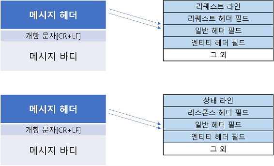

# HTTP

- Hyper Text Transfer Protocol약자로 하이퍼텍스트 간의 문서를 교환하기 위하여 사용된 통신 규약이다.

- WWW상에서 정보(문서)를 주고받을 수 있는 프로토콜이며, TCP, UDP를 사용한다.(80번 포트를 사용한다.)

- (즉 웹 서버와 클라이언트 간의 통신을 하기 위한 통신 규약이다.)
---
## HTTP의 특징
- HTTP는 연결 상태를 유지하지 않는 비연결성 프로토콜 이다.

- HTTP는 요청/응답(request/response) 방식으로 동작한다. 

- HTTP는 요청과 응답을 메시지(http message)를 통해 데이터를 교환한다.
---
## HTTP request methods(주로 사용하는 요청들)
  - #### GET: 
		특정 리소스의 표시를 요청, 
		GET을 사용하는 요청은 오직 데이터를 받기만 한다.
  - #### POST:
		특정 리소스에 엔티티를 제출할 때 쓰인다.
		(클라이언트에서 서버로 데이터를 전송한다.)
  - #### PUT:
		목적 리소스의 모든 현재 표시를 요청 payload로 바꾼다.
		(즉, 리소스를 수정, 갱신한다.) 
  - #### PATCH:
		리소스의 부분만을 수정하는 데 쓰인다.
  - #### DELETE: 
		특정 리소스를 삭제 한다.
---
## HTTP 메시지 구조

#### 리퀘스트 라인
	리퀘스트에 사용하는 메소드와 리퀘스트 URI와 사용하는 HTTP 버전이 포함된다.
#### 상태 라인
	리스폰스 결과를 나타내는 상태코드와 설명, 사용하는 HTTP 버전이 포함되어있다.
#### 헤더 필드
	리퀘스트와 리스폰스의 여러 조건과 속성 등을 나타내는 각종 헤더 필드가 포함된다.
---
## HTTP 상태코드

### 2xx : 성공(Success)
	2xx response는 request가 정상으로 처리되었음을 나타낸다.
- 200(OK) : 클라이언트가 보낸 리퀘스트를 서버가 정상 처리하였음을 나타낸다.
- 204(No Content) : 서버가 리퀘스트를 받아서 처리하는 데는 성공했지만, response에 엔티티 바디를 포함하지 않는다.(어떠한 엔티티 바디를 되돌려 보내서도 안된다.)
- 206(Partial Content) : Range에 의해서 정해진 범위만큼을 request받음을 나타낸다(response에는 Contents-Range로 지정된 범위의 엔티티가 포함되있다.)

### 3xx : 리다이렉트(Redirection)
	3xx response는 request가 정상적으로 처리를 종료하기 위해 브라우저 측에서 특별한 처리를 수행해야 함을 나타낸다.
- 301(Moved Permanently) : request된 리소스에는 새로운 URI가 부여되어있어, 다음부터는 그 리소스를 참조하는 URI를 사용해야 함을 나타낸다.
- 302(Found) : request된 리소스에는 새로운 URI가 할당되어 있기 때문에 그 URI를 참조하라는 의미를 나타낸다.
- 303(See Other) : request에 대한 리소스는 다른 URI에 있기 때문에 GET Method를 사용해서 얻어야 함을 나타낸다.(302와 같은 기능이지만, redirection place를 GET Method로 얻어야 한다고 명확하게 되어있는 점이 302와 다르다.)
- 304(Not Modified) : 클라이언트가 조건부 request를 했을 때 리소스에 대한 액세스는 허락하지만, 조건이 충족되지 않음을 나타낸다.

### 4xx : 클라이언트 에러(Client Error)
	4xx response는 클라이언트의 원인으로 에러가 발생했음을 나타낸다.
- 400(Bad Request) : request 구문이 잘못되었음을 나타낸다.(이 에러가 발생한 경우 request내용을 재검토 하고 나서 재송신할 필요가 있다.)
- 401(Unauthorized) : request에 HTTP인증정보가 필요하다는 것을 나타내고 있다. 또한 이미 1번 request가 이루어진 경우에는 유저 인증에 실패했음을 표시한다.
- 403(Forbidden) : request된 리소스의 액세스가 거부되었음을 나타내고 있다.(서버 측은 거부의 이유를 분명히 할 필요가 있는데, 엔티티바디에 기재해서 유저측에 표시한다.)
- 404(Not Found) : request한 리소스가 서버에 없음을 나타낸다.

### 5xx : 서버 에러(Server Error)
	5xx response는 서버 원인으로 에러가 발생하고 있음을 나타낸다.
- 500(Internal Server Error) : 서버에서 request를 처리하는 도중에 에러가 발생하였음을 나타낸다.(웹 어플리케이션에 에러가 발생한 경우나, 일시적인 경우도 있다.)
- 503(Service Unavaliable) : 일시적으로 서버가 과부하 상태이거나 점검중이기 때문에 현재 request를 처리할 수 없음을 나타낸다.