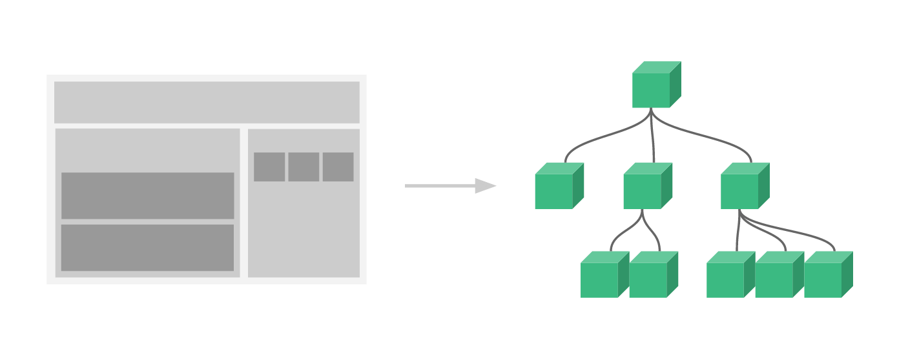

# Vue js

> Vue는 View의 발음에서 따온 것으로, 말 그대로 화면 작에서 최적화 된 자바스크립트 프레임워크이다.
>
> MVVM(Model - View - ViewModel) 패턴 기반으로 디자인되었고, 컴포넌트 기반으로 재사용 가능한 UI들을 조합하여 사용 할 수 있다. 

### 특징

- **MVVM Pattern**

  > Model - View - ViewModel의 줄임말로 로직과 UI의 분리를 위해 설계된 패턴이다.
  >
  > HTML, CSS가 View 역할을 하고, Javascript가 Model 역할을 한다.
  >
  > ViewModel이 없는 경우 DOM API를 이용해(getElementById) View와 Model을 직접 연결시켜야 하는데, 이런 경우 Javascript에서 컨트롤러 역할까지 하며 코드의 양이 증가한다.
  >
  > ViewModel이 중간에서 그 컨트롤러 역할을 하는 것이 MVVM 패턴이다. Vue.js가 담당하며, 미리 정의된 옵션들을 통해서 데이터의 변화를 감지하거나 이벤트를 등록한다.

  

- **Virtual Dom**

  > Virtual Dom 즉 가상 Dom이란 DOM(Document Object Model)의 복사본을 메모리 내에 저장해서 사용하여, Javascript로 DOM을 조작하며 생긴 변경 사항을 가상의 위치에서 처리함으로, 실제 DOM의 렌더링을 최소화 하는 방식이다.(Virtual Dom을 사용한 예는 대표적으로 Vue, React등의 프레임워크들이 있다.)

  

- **Component**

  > 화면에 보여지는 페이지를 구성하는 요소를 쪼개서 재활용이 가능한 형태로 관리하는 것, 하나의 컴포넌트는 미리 정의된 옵션을 갖고 있는 Vue 인스턴스이다.
  >
  > 컴포넌트들을 조합하여 페이지를 구성할 수 있고, 이를 활용해 각 코드들의 의존도를 낮추고 재활용성을 높일 수 있다.
  >
  >  **("싱글 파일 컴포넌트 체계" 에서는 Template(HTML), Style(CSS), Script(JavaScript)로 구성되어있다.)**

---

### Vue Instance

> 뷰 인스턴스는 뷰로 화면을 개발하기 위해 필수적으로 생성해야 하는 기본 단위이다.
>
> 뷰 인스턴스를 생성할때는 데이터, 템플릿, 마운트할 엘리먼트, 메소드, 라이프사이클 콜백 등의 옵션을 포함 할 수있는 **options 객체**를 전달 해야한다.

```javascript
var vm = new Vue({
    // 옵션
})
```


##### Options

- **data**

  > 컴포넌트의 속성을 정의하는 객체.
  >
  > 뷰 인스턴스 내부에서 직접 이용되지 않고, 뷰 인스턴스와 data 옵션 사이에 **프록시**를 두어 처리한다.
  >
  > data 옵션은 뷰 인스턴스가 관찰하는 객체이므로 변경사항은 즉시 감지되어(반응형) 데이터가 변경되면 화면도 다시 렌더링된다.

  > **프록시란 ?** 
  >
  > 대리인 이라는 뜻을 가지고 있다. 사용자가 직접 요청을 하기보다는 한 단계 앞에 프록시를 두어 간접적으로 접근하게 한다. 이를 흐름제어라 한다. 프록시를 사용하면, 잘못된 요청을 방지할 수 있다. 
  >
  > *중요한 것은, 흐름제어만 할 뿐 결과 값을 조작해서는 안 된다.*

  ```js
  var vm = new Vue({
          data: {
              name: 'paul',
              age: 19
          },
          created: function() { // 페이지 호출 및 data 등의 옵션 호출 완료 후
              console.log(this.name); // paul
          }
  })
  ```

- **el**

  > 뷰 인스턴스에 연결할 HTML DOM 요소를 지정한다.
  >
  > 한 개의 요소만 지정할 수 있다. 동적으로 지정할 수 있으나, 한 번 HTML 요소가 연결되면 도중에 연결된 요소를 변경할 수 없다. 따라서 도중 바뀔 일이 없으므로 최초 인스턴스 생성 시 el은 직접 지정하는 것이 좋다.

  ```html
  <div id="example">
      <h2>hi</h2>
  </div>
  <script type="text/javascript">
      var vm = new Vue({
          el: "#example"
      })
  </script>
  ```

- **methods**

  > 뷰 인스턴스에서 사용할 메서드들을 정의하는 객체.
  >
  > 정의(등록)된 메서드는 뷰 인스턴스 내에서 직접 호출할 수 있고, HTML에서는 뷰가 제공하는 디렉티브 표현식(v-model, v-click 등) 및 콧수염 표현식({{}})으로 호출할 수 있다.

  ```html
  <div id="example">
      <h1>{{ getAge() }}</h1> // 콧수염 표현식
      <h2 v-model="getAge()"></h2> // 디렉티브 표현식
  </div>
  <script type="text/javascript">
      var vm = new Vue({
          el: "#example",
          data: {
              name: 'choi',
              age: 25
          },
          methods: {
              getAge() {
                  console.log(this.age);
              },
              getGetAge() {
                  this.getAge(); // 인스턴스 내 호출
              }
          }
      })
  </script>
  ```

- **watch**

  > 계산형 속성과 같이 하나의 데이터를 기반으로 다른 데이터를 변경할 필요가 있을 때 사용한다. (주로 긴 처리 시간이 필요한 비동기 처리에 적합하다.)
  >
  > 속성 이름과 해당 속성 값이 변경되었을 때 호출할 함수를 등록한다 즉, 값이 바뀔 때마다 매번 함수가 호출된다.

  ```html
  <div id="app">
      x: <input type="text" v-model="x"><br>
      y: <input type="text" v-model="y"><br>
      덧셈 결과: {{ sum }}
  </div>
  <script type="text/javascript">
      var vm = new Vue({
          el: '#app',
          data: {
              x: 0,
              y: 0,
              sum: 0
          },
          watch: {
              x: function (n) {
                  console.log('x 변경');
                  var result = Number(n) + Number(this.y);
                  this.sum = result;
              },
              y: function (n) {
                  console.log('y 변경');
                  var result = Number(n) + Number(this.x);
                  this.sum = result;
              }
          }
      })
  </script>
  ```

---

### Lifecycle

Vue,js의 라이프 사이클은 크게 Creation, Mounting, Updating, Destruction으로 나눌 수 있다.


##### Creation: 컴포넌트 초기화 단계

> 라이프사이클 중에 가장 처음 실행되는 단계이다. 이 단계는 컴포넌트가 DOM에 추가되기 전이다.(서버 렌더링에서도 지원되는 훅) ***! 아직 컴포넌트가 DOM에 추가되기 전이기 때문에 DOM에 접근하거나 this.$el를 사용할 수 없다.***

- **beforeCreate**

  모든 훅 중에 가장 먼저 실행되는 훅이다. 아직 data와 events(on, once, off, emit 등)가 세팅되지 않은 시점이다.

  ```html
  <script>
    export default {
      data () {
        return {
          title: ''
        }
      },
  
      beforeCreate () {
        //can't use Data(this.title ...), events(vm.$on, vm.$once, vm.$off, vm.$emit)
      }
    }
  </script>
  ```

- **created**

  created 훅에서는 data와 events가 활성화 되어 접근이 가능하다. 하지만 template, Virtual DOM은 마운트 및 렌더링되지 않은 상태이다.

  ```html
  <script>
    export default {
      data () {
        return {
          title: ''
        }
      },
      computed: {
        titleComputed() {
          console.log('I change when this.property changes.')
          return this.property
        }
      },
      created () {
        //can use Data(this.title, this.titleComputed ...), events(vm.$on, vm.$once, vm.$off, vm.$emit)
        //don't use $el
      }
    }
  </script>
  ```


##### Mounting: DOM 삽입 단계

> Mounting 단계는 초기 렌더링 직전에 컴포넌트에 직접 접근이 가능하다. (서버 렌더링 에서는 지원하지 않는다.)

- **beforeMount**

  beforeMount 훅은 템플릿과 render함수들이 컴파일 된 후 첫 렌더링이 일어나기 직전에 실행된다. (대부분의 경우 사용하지 않는 것이 좋다. ~~사용하지도 않는다.~~)

- **mounted**

  mounted 훅에서는 컴포넌트, 템플릿, 렌더링된 돔에 접근할 수 있다.( **!** 모든 하위 컴포넌트가 마운트된 상태를 보장하지는 않는다.)

  ```html
  <script>
  export default {
    mounted() {
      console.log(this.$el.textContent) // can use $el
      this.$nextTick(function () {
        // 모든 화면이 렌더링된 후 실행됩니다.
      })
    }
  }
  </script>
  ```

  **!!!** mounted훅에서 유의할 점은, 부모와 자식 관계의 컴포넌트에서 mounted발생 순서가 **자식 -> 부모** 순서로 진행된다는 것이다.(당연히 부모 -> 자식 이라고 생각했을것이다.)

  

  위 그림처럼 Created훅은 **부모 -> 자식** 순서로 진행되지만 mounted는 그렇지 않은 것을 확인할 수 있다.(mounted 훅에서 부모는 자식의 훅이 끝나기를 기다린 후 진행됨을 알 수 있다.)


##### Updating: Diff 및 재 렌더링 단계

> 컴포넌트의 속성들이 변경되는 등의 이유로 재 렌더링이 발생되면 실행된다.(디버깅이나 프로파일링 등을 위해 컴포넌트 재 렌더링 시점을 알고 싶을때 사용할 수 있다.)

- **beforeUpdate**

  컴포넌트의 데이터가 변하여 업데이트 사이클이 시작될때 실행된다.(정확히는 DOM이 재 렌더링 되고 패치되기 직전에 실행된다.) 재 렌더링 전의 새 상태의 데이터를 얻을 수 있고 더 많은 변경이 가능하다.(이 변경으로 인한 재 렌더링은 트리거되지 않는다.)

- **updated**

  컴포넌트의 데이터가 변하여 재 렌더링이 일어난 후에 실행된다. DOM의 업데이트가 완료된 상태이므로 종속적인 연산이 가능하다.(그러나 여기서 상태를 변경하면 무한루프에 빠질 수 있다.)

  ```html
  <script>
  export default {
    updated() {
      this.$nextTick(function () {
        // 모든 화면이 렌더링된 후 실행됩니다.
      })
    }
  }
  </script>
  ```


##### Destruction: 해체 단계

- **beforeDestroy**

   이 훅은 해체(뷰 인스턴스 제거)된 후에 호출된다. 뷰 인스턴스의 모든 디렉티브가 바인딩 해제되고, 모든 이벤트 리스너가 제거되며, 모든 하위 뷰 인스턴스도 삭제된다.(서버 렌더링시 호출되지 않는다.)

---

### Component

> 뷰 컴포넌트란 화면에 그려지는 View의 단위를 쪼개서 재활용이 가능한 형태로 관리하는 것을 말한다. (즉, 컴포넌트란 애플리케이션을 구성하는 요소라고 할 수 있다.)
>
> 컴포넌트를 사용함으로써 재사용성을 높일 수 있고, 단위별(기능별)로 쪼개어 관리하기에 테스트가 용이하다.



- **기본적인 컴포넌트 등록 방법은 아래와 같다.**

  ```html
  <div id="app">
    <!-- 템플릿에 컴포넌트 적용 -->
    <my-component></my-component>
  </div>
  ```

  ```javascript
  // 등록
  Vue.component('my-component', {
    template: '<div>A custom component!</div>'
  })
  // Vue 인스턴스 생성
  new Vue({
    el: '#app'
  })
  ```


##### 컴포넌트 간 통신(상호작용)

> 부모 컴포넌트는 Props를 통해서 자식 컴포넌트에게 데이터를 전달할 수 있다. 데이터 전달은 부모에서 자식으로 단방향이며, 양방향통신도 가능하지만 어플리케이션이 복잡해지고, 유지보수가 어려워져 권장하지 않는다.
>
> 자식 컴포넌트는 $emit을 사용해 부모 컴포넌트로 이벤트를 발신할 수 있다.


- **props로 데이터 전달하기 (부모 -> 자식)**

  부모-자식 컴포넌트 간 상호작용은 속성(Props)과 이벤트로 이루어진다. 각 컴포넌트 내부의 데이터는 캡슐화 되기 때문에 다른 컴포넌트나 앱에서 접근할 수 없다. 따라서 속성과 이벤트를 이용해야 한다.

  ```javascript
  Vue.component('child', {
    // props 정의
    props: ['message'],
    // 데이터와 마찬가지로 prop은 템플릿 내부에서 사용할 수 있으며
    // vm의 this.message로 사용할 수 있습니다.
    template: '<span>{{ message }}</span>'
  })
  ```

  그런 다음 일반 문자열(즉 props데이터)을 다음과 같이 전달할 수 있다.

  ```html
  <child message="안녕하세요!"></child>
  ```

- **사용자 지정 이벤트 (자식 -> 부모)**

  자식 컴포넌트에서 이벤트를 발신($emit)하면 부모 컴포넌트에서 v-on 디렉티브를 이용해 이벤트를 수신한다.

  ```html
  <div id="counter-event-example">
    <p>{{ total }}</p>
    <button-counter v-on:increment="incrementTotal"></button-counter>
    <button-counter v-on:increment="incrementTotal"></button-counter>
  </div>
  ```

  ```javascript
  Vue.component('button-counter', {
    template: '<button v-on:click="incrementCounter">{{ counter }}</button>',
    data: function () {
      return {
        counter: 0
      }
    },
    methods: {
      incrementCounter: function () {
        this.counter += 1
        this.$emit('increment')
      }
    },
  })
  
  new Vue({
    el: '#counter-event-example',
    data: {
      total: 0
    },
    methods: {
      incrementTotal: function () {
        this.total += 1
      }
    }
  })
  ```


##### Single File Component(단일 파일 컴포넌트)

> 단일 파일 컴포넌트란 Vue어플리케이션의 복잡도가 증가함에 따라 발생하는 여러 문제들을 해결하기 위해 생겨난 관리 방법이다.
>
> ```.vue``` 라는 파일 단위 안에 html(template), js, css 를 관리 할 수 있다.

- 단일 파일 컴포넌트의 구조는 다음과 같다

  ```vue
  <template>
  <!-- 컴포넌트의 HTML 즉 템플릿을 작성한다. -->
  </template>
  
  <style>
  /* 컴포넌트의 CSS를 작성한다. scope옵션을 통해 이 컴포넌트에만 적용되게 할 수 있다. */
  </style>
  
  <script>
  // 컴포넌트의 SCRIPT를 작성한다.
  </script>
  ```

---

### Vue Router

> Vue 를 이용한 SPA(Single File Application)를 제작할 때 유용한 **라우팅 라이브러리**이다. Vue Router의 가장 큰 장점은    페이지를 다시 시작하지 않아도(새로고침 하지 않아도) 페이지의 이동, 렌더링이 가능하다는 점이다.

- Vue Router를 사용할때 추가로 해야하는 것은 라우터에 컴포넌트를 매핑한 후, 어떤 주소에서 렌더링 할 지 알려주는 것 뿐이다. 아래의 예제를 통해 알아보자

  ```html
  <script src="https://unpkg.com/vue/dist/vue.js"></script>
  <script src="https://unpkg.com/vue-router/dist/vue-router.js"></script>
  
  <div id="app">
    <h1>Hello App!</h1>
    <p>
      <!-- 네비게이션을 위해 router-link 컴포넌트를 사용합니다. -->
      <!-- 구체적인 속성은 `to` prop을 이용합니다. -->
      <!-- 기본적으로 `<router-link>`는 `<a>` 태그로 렌더링됩니다.-->
      <router-link to="/foo">Go to Foo</router-link>
      <router-link to="/bar">Go to Bar</router-link>
    </p>
    <!-- 라우트 아울렛 -->
    <!-- 현재 라우트에 맞는 컴포넌트가 렌더링됩니다. -->
    <router-view></router-view>
  </div>
  ```

  ```js
  // 0. 모듈 시스템 (예: vue-cli)을 이용하고 있다면, Vue와 Vue 라우터를 import 하세요
  // 그리고 `Vue.use(VueRouter)`를 호출하세요
  
  
  // 1. 라우트 컴포넌트를 정의하세요.
  // 아래 내용들은 다른 파일로부터 가져올 수 있습니다.
  const Foo = { template: '<div>foo</div>' }
  const Bar = { template: '<div>bar</div>' }
  
  // 2. 라우트를 정의하세요.
  // Each route should map to a component. The "component" can
  // 각 라우트는 반드시 컴포넌트와 매핑되어야 합니다.
  // "component"는 `Vue.extend()`를 통해 만들어진
  // 실제 컴포넌트 생성자이거나 컴포넌트 옵션 객체입니다.
  const routes = [
    { path: '/foo', component: Foo },
    { path: '/bar', component: Bar }
  ]
  
  // 3. `routes` 옵션과 함께 router 인스턴스를 만드세요.
  // 추가 옵션을 여기서 전달해야합니다.
  // 지금은 간단하게 유지하겠습니다.
  const router = new VueRouter({
    routes // `routes: routes`의 줄임
  })
  
  // 4. 루트 인스턴스를 만들고 mount 하세요.
  // router와 router 옵션을 전체 앱에 주입합니다.
  const app = new Vue({
    router
  }).$mount('#app')
  
  // 이제 앱이 시작됩니다!
  ```

  이제 위와 같이 작성된 어플리케이션은 ```/foo```로 접근하면 Foo컴포넌트가 렌더링 되고, ```/bar```로 접근하면 Bar컴포넌트가 렌더링된다.


##### Nested Routers

> 라우터를 이용해 화면을 이동할 때 **중첩된 라우트(Nested Route)** 를 이용하여 여러개의 컴포넌트를 렌더링 할 수 있다.
>
> 렌더링 되는 컴포넌트의 구조는 가장 큰 상위의 컴포넌트가 하위의 컴포넌트를 포함하는 ```Parent - Child```형태와 같다.

```html
<!-- localhost:5000 -->
<div id="app">
  <router-view></router-view>
</div>

<!-- localhost:5000/home -->
<div>
  <p>Main Component rendered</p>
  <app-header></app-header>
</div>
```

```js
// localhost:5000/home 에 접근하면 Main 과 Header 컴포넌트 둘다 렌더링 된다.
{
  path : '/home',
  component: Main,
  children: [
    {
      path: '/',
      component: AppHeader
    },
    {
      path: '/list',
      component: List
    },
  ]
}
```


##### HTML5 History Mode

> ```vue-router```의 기본 모드는 *hash mode*로 URL 해시를 사용하여 전체 URL을 시뮬레이트하므로 URL이 변경될 때 페이지가 다시 로드 되지 않습니다. 하지만 미관상(?) 좋지 못합니다.
>
> 그래서, 해시를 제거하기 위해 라우터의 **history mode** 를 사용할 수 있습니다. `history.pushState` API를 활용하여 페이지를 다시 로드하지 않고도 URL 탐색을 할 수 있습니다.

```js
const router = new VueRouter({
  mode: 'history',
  routes: [...]
})
```

